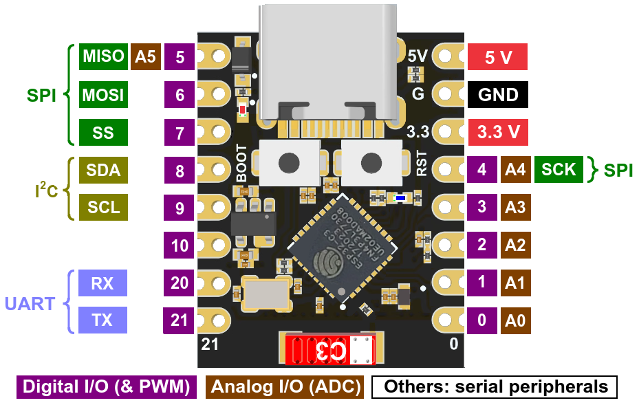

# Super Mini ESP32C3 Arduino Sketches / PlatformIO Projects

**Source code that accompanies the May 2024 version of [First Look at the Super Mini ESP32-C3](https://sigmdel.ca/michel/ha/esp8266/super_mini_esp32c3_en.htm)**.



<!-- TOC -->

- [1. Introduction](#1-introduction)
- [2. Arduino IDE Notes](#2-arduino-ide-notes)
- [3. PlatformIO Notes](#3-platformio-notes)
- [4. List of Projects](#4-list-of-projects)
  - [01_pin_names](#01_pin_names)
  - [02_blink_pulse_led](#02_blink_pulse_led)
  - [03_scan_wifi](#03_scan_wifi)
  - [04_wifi_connect](#04_wifi_connect)
  - [05_wifi_tx_power](#05_wifi_tx_power)
  - [06_async_web_led](#06-_async_web_led)
- [5. License](#5-license)

<!-- /TOC -->

## 1. Introduction

The Super Mini ESP32C3 boards are a small simplified versions of the original Espressif development boards for the ESP32C microcontroller. Unlike older Espressif microcontrollers these boards have a RISC-V core. It should be possible to compile each project with PlatformIO, and in the Arduino IDE and then upload them to the Super Mini. 
## 2. Arduino IDE Notes

Arduino sketches must have an `.ino` file name extension and must be contained in a directory that has the same name as the Arduino sketch (excluding the extension). Consequenty the `01_pin_names` project containts a directory named `pin_names` that in turn contains the Arduino sketch `pin_names.ino`. That sketch is basically empty as it is a long comment only. This is not a problem because the Arduino IDE will import all source files found in the sketch directory. The actual code is in `main.cpp` which is the default name of a PlatformIO project.

 

To compile and then upload the sketch in the Arduino IDE, click on the **File** top menu, click on **Open...**, then navigate to the `pin_names.ino` file and open it with the system file manager.

Following the instructions in [Installing using Arduino IDE](https://docs.espressif.com/projects/arduino-esp32/en/latest/installing.html#installing-using-arduino-ide) the development release of the Arduino-ESP32 framework was installed by entering the following URL 
```
https://raw.githubusercontent.com/espressif/arduino-esp32/gh-pages/package_esp32_dev_index.json
```
into the `Additional Board Manager URLs` field of the Arduino Preferences.


## 3. PlatformIO Notes

Because of the Arduino sketch naming constraints, the `main.cpp` file of a project is not stored in the `src` directory. To work around this change, a `src_dir` entry is added in the `platformio.ini` file to provide the name of the directory in which `main.cpp` is found. That will be the name of the Arduino sketch as shown here for the `01_pin_names` project. 

```ini
[platformio]
; Make the Arduino IDE happy (.INO file must be in a directory of the same name)
src_dir = pin_names
```

PlatformIO will "convert" the Arduino sketch, but that is of no consequence since it contains only comments.

## 4. List of Projects      

### 01_pin_names
### 02_blink_pulse_led
### 03_scan_wifi
### 04_wifi_connect
### 05_wifi_tx_power
### 06_async_web_led

## 5. License

Copyright 2024, Michel Deslierres. No rights reserved. 

While the copyright pertaining to included libraries must be respected, all the code by Michel Deslierres in this repository is in the public domain. In those jurisdictions where this may be a problem, the [BSD Zero Clause License](https://spdx.org/licenses/0BSD.html) applies.
